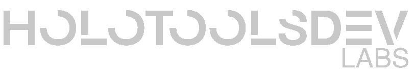

# HoloToolsDev Labs 🎀

<picture>
  <source media="(prefers-color-scheme: dark)" srcset="../public/banner-dark.png">
  <source media="(prefers-color-scheme: light)" srcset="../public/banner-light.png">
  
</picture>

**Focusing on building practical tools for Hololive Fans (Holomen-oriented)**

## 🌸 Current Projects

### [HoloCalendar](https://calendar.holotools.dev/) 📅
- Consolidates important dates for all HoloMen: debut anniversaries, birthdays, etc.
- Multilingual support: Japanese/English/Chinese interface switching
- Community collaboration: Fan-contributed date maintenance system

## 🚧 Development Roadmap

### Web Tools
- More fan-oriented tools in planning (details to be added)

### Desktop Applications
- Windows/macOS applications in preparation (details to be added)

> 💡 Roadmap will be continuously updated based on community feedback. Suggestions welcome

## 👩💻 Contribution
Welcome Hololive female talent fans/developers to join:
1. Submit improvements via Pull Request
2. Can apply to become dedicated tool maintainers

## 📜 License
MIT License - Please comply with [Hololive Derivative Works Guidelines](https://hololivepro.com/en/terms/)

> 📢 Disclaimer: This is an unofficial fan project, not officially affiliated with COVER Corp.
