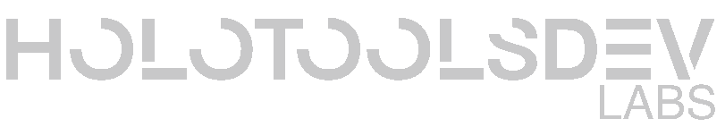

# HoloToolsDev Labs 🎀

<picture>
  <source media="(prefers-color-scheme: dark)" srcset="../public/banner-dark.png">
  <source media="(prefers-color-scheme: light)" srcset="../public/banner-light.png">
  
</picture>

**Hololiveファン向け実用ツール開発に特化（ホロメン方向）**

## 🌸 現在のプロジェクト

### [HoloCalendar](https://hksts.eu.org) 📅
- ホロメン全員のデビュー記念日・誕生日等重要日を統合
- 多言語対応: 日本語/英語/中国語インターフェース切替
- ファン協力体制: コミュニティ共同での日付データ管理

## 🚧 開発ロードマップ

### Webツール
- ファン向け追加ツールを計画中（内容追予定）

### デスクトップアプリ
- Windows/macOS向けアプリケーション準備中（内容追予定）

> 💡 ロードマップはコミュニティフィードバックに基づき随時更新

## 👩💻 コントリビューション
ホロライブ女性メンバーファン開発者募集：
1. Pull Requestでの改善提案
2. 専用ツールメンテナー申請可

## 📜 ライセンス
MIT License - [ホロライブ二次創作ガイドライン](https://hololivepro.com/terms/) に準拠

> 📢 声明: 本プロジェクトはファン自主開発であり、カバー株式会社とは公式関係ありません
